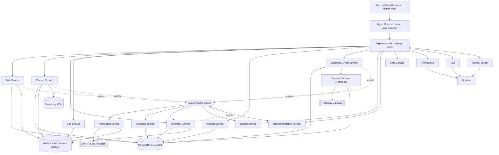
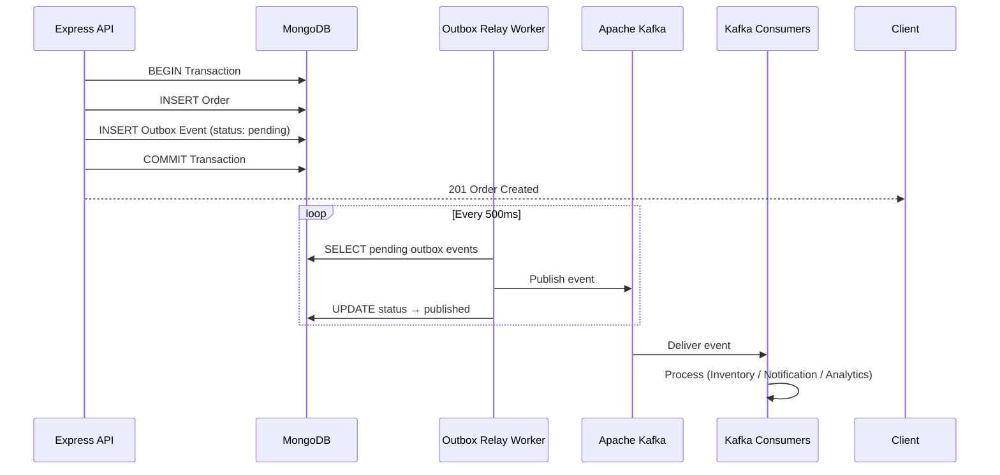
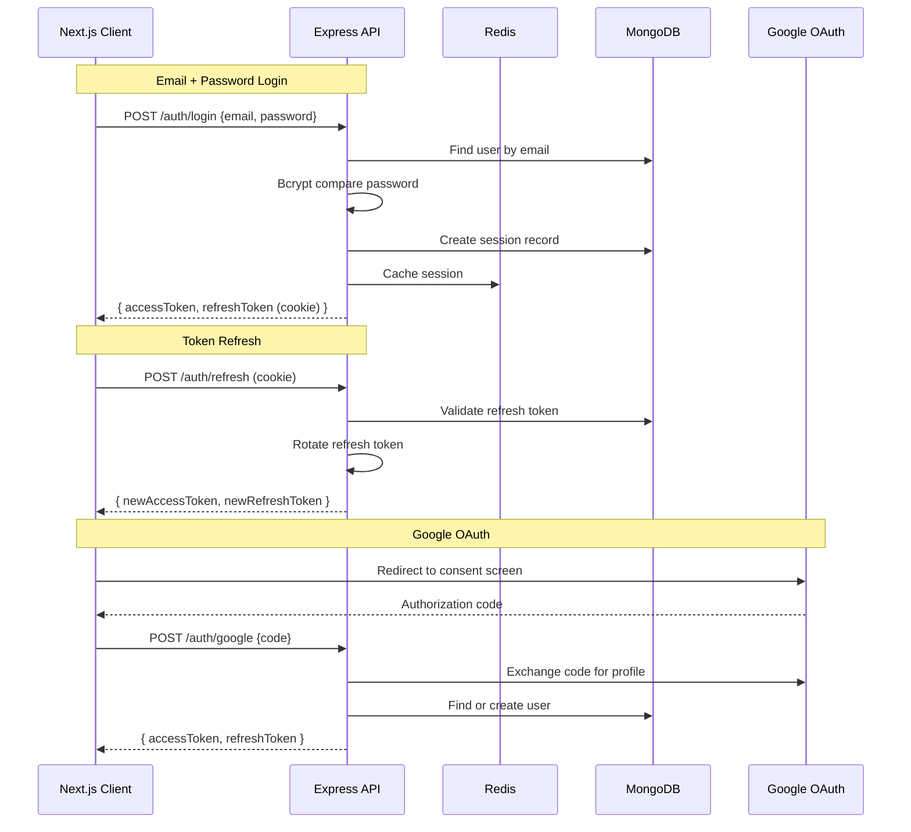
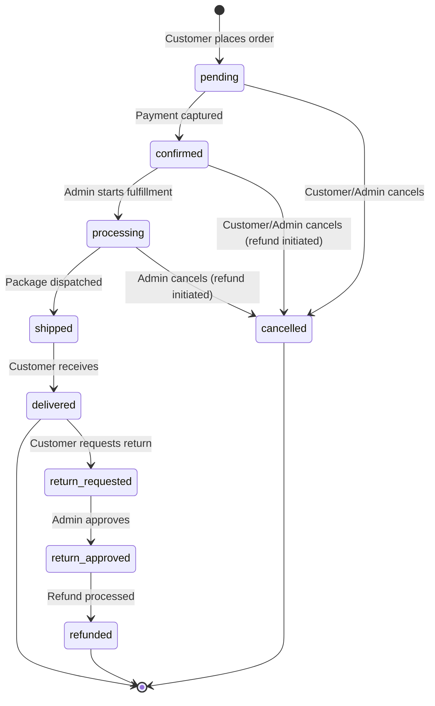
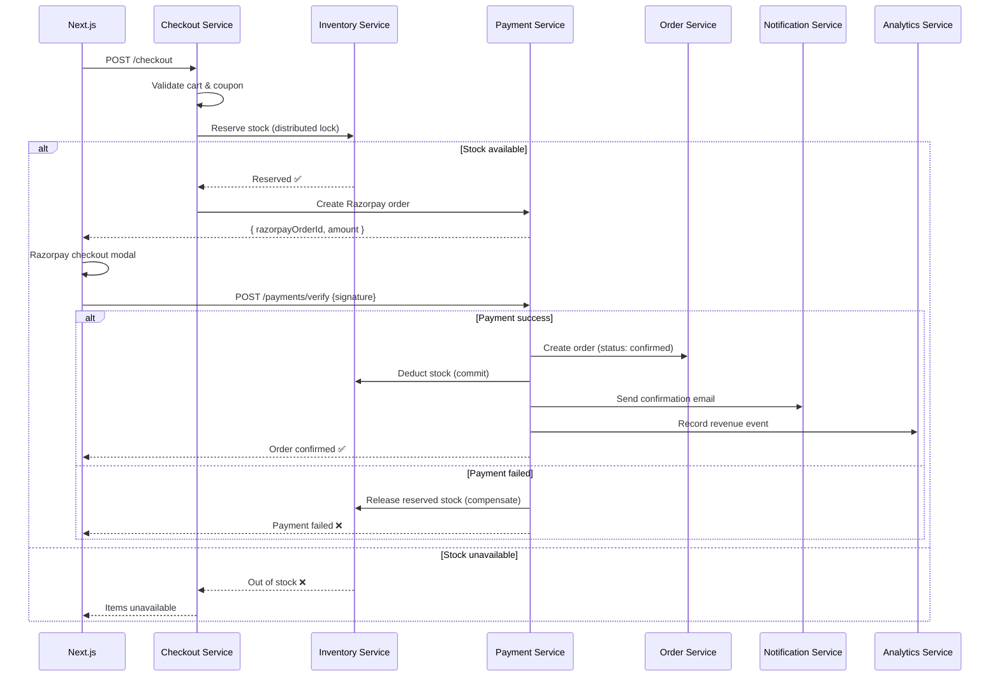
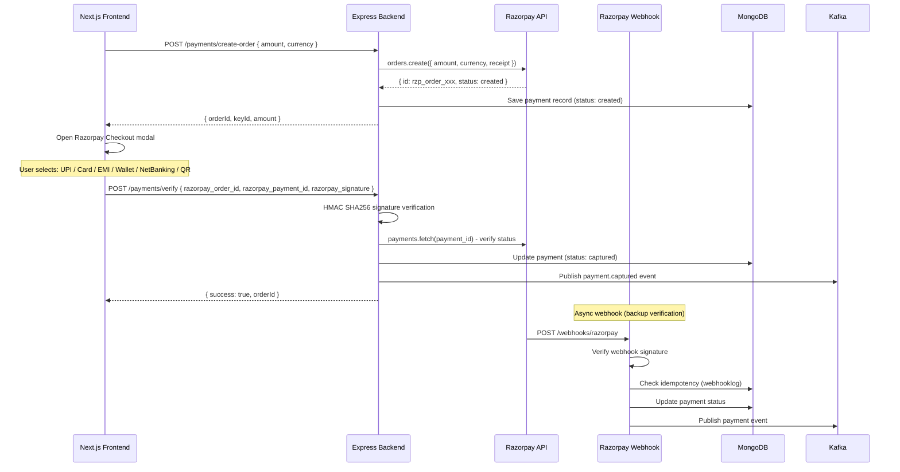
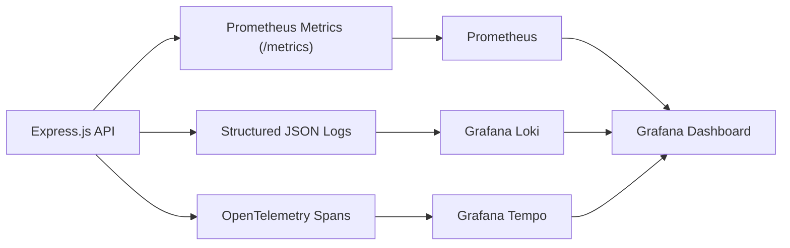
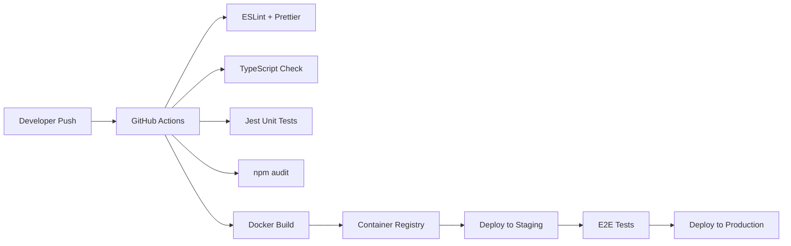

# Antigravity — Enterprise Jewellery & Cosmetics Commerce Platform

### Production-Grade, Event-Driven, Cloud-Native Commerce Architecture

> **Version:** 1.0 — Enterprise Blueprint  
> **Architecture Style:** Event-Driven Microservices (Modular Monolith → Microservices Ready)  
> **Frontend:** Next.js 16 (App Router) + TypeScript  
> **Backend:** Node.js + Express.js (Clean Architecture)  
> **Database:** MongoDB (Mongoose ODM, Replica Set)  
> **Cache:** Redis  
> **Event Streaming:** Apache Kafka (KafkaJS)  
> **Background Jobs:** BullMQ (Redis-backed)  
> **Object/Media Storage:** Cloudinary  
> **Payment Gateway:** Razorpay (UPI, QR, Cards, Wallets, EMI, Net Banking, Pay Later, Subscriptions)  
> **Containerization:** Docker + Docker Compose  
> **Reverse Proxy:** Nginx  
> **Authentication:** JWT (Access + Refresh) + Google OAuth 2.0 + Email/SMS OTP  
> **Observability:** Prometheus, Grafana, Loki, Tempo, Jaeger  
> **Documentation Standard:** Antigravity Enterprise Standard v1.0

---

## Table of Contents

| Part | Section | Description |
|------|---------|-------------|
| 1 | [Project Vision](#1-project-vision) | Mission, scope, and design philosophy |
| 2 | [Core Objectives](#2-core-objectives) | 16 engineering objectives |
| 3 | [Business Domains](#3-business-domains) | Jewellery, Cosmetics, Skin Care, Hair Care, Fragrance, Accessories |
| 4 | [Enterprise Technology Stack](#4-enterprise-technology-stack) | Complete tech inventory |
| 5 | [Architecture Principles](#5-architecture-principles) | Event-driven, CQRS, Saga, Outbox, Idempotency |
| 6 | [High-Level Architecture](#6-high-level-architecture) | System topology diagram |
| 7 | [Monorepo Folder Structure](#7-monorepo-folder-structure) | Complete file hierarchy |
| 8 | [MongoDB Design & Schemas](#8-mongodb-design--schemas) | All collections and relationships |
| 9 | [Redis Strategy & BullMQ](#9-redis-strategy--bullmq) | Cache, locks, queues, sessions |
| 10 | [Kafka Event Architecture](#10-kafka-event-architecture) | Topics, producers, consumers, outbox |
| 11 | [Authentication & Authorization](#11-authentication--authorization) | JWT, OAuth, OTP, RBAC, sessions |
| 12 | [Order Lifecycle & Saga Pattern](#12-order-lifecycle--saga-pattern) | Checkout flow with rollback |
| 13 | [Razorpay Payment Architecture](#13-razorpay-payment-architecture) | UPI, QR, Cards, EMI, Wallets, Webhooks |
| 14 | [Notification, Search & Recommendation](#14-notification-search--recommendation-services) | Email, SMS, WhatsApp, AI search |
| 15 | [Docker Architecture & Compose](#15-docker-architecture--compose) | Full containerized infrastructure |
| 16 | [Environment Configuration](#16-environment-configuration) | All .env templates |
| 17 | [Monitoring & Observability](#17-monitoring--observability) | Prometheus, Grafana, Loki, Tempo |
| 18 | [Security Hardening](#18-security-hardening) | Defense-in-depth strategy |
| 19 | [CI/CD Pipeline](#19-cicd-pipeline) | Build, test, deploy automation |
| 20 | [Production Deployment](#20-production-deployment) | Scaling, disaster recovery |
| 21 | [Testing Strategy](#21-testing-strategy) | Unit, integration, E2E |
| 22 | [API Standards](#22-api-standards) | REST conventions, versioning |
| 23 | [Future Roadmap](#23-future-roadmap) | Kubernetes, AI, microservices |
| 24 | [Quick Start](#24-quick-start) | Local development setup |

---

## 1. Project Vision

**Antigravity** is an enterprise-grade **Jewellery & Cosmetics Commerce Platform** engineered for high-scale, real-world production use — not a CRUD demo.

It is designed from the ground up around five pillars:

| Pillar | Description |
|--------|-------------|
| **Scalability** | Horizontal scale-out across stateless services |
| **Security** | Defense-in-depth at every layer (auth, transport, storage, payments) |
| **Maintainability** | Clean Architecture with strict separation of concerns |
| **Modularity** | Domain-isolated services extractable into microservices |
| **Cloud-Native** | Fully containerized, 12-factor, observability-first |

Unlike a traditional monolithic e-commerce app, Antigravity follows an **Event-Driven Enterprise Architecture**: every meaningful business action (order placed, payment captured, stock changed, OTP verified) is emitted as an **event** on Kafka and processed asynchronously by independent consumers. REST APIs handle only the synchronous "accept the request" concern; everything downstream (inventory sync, notifications, analytics, audit) happens off the critical path.

The platform is designed to serve **millions of customers** while maintaining low latency, high availability, fault tolerance, and full observability across every service.

> **Note on MySQL/Authorize.Net:** Antigravity uses **MongoDB exclusively**. Any prior references to MySQL (Aiven), MariaDB, PostgreSQL, or Authorize.Net from unrelated projects (e.g., EntityKart) are **not part of this stack** and are intentionally omitted in all environment templates.

---

## 2. Core Objectives

| # | Objective | What It Means in Practice |
|---|-----------|---------------------------|
| 1 | Enterprise-grade Architecture | Layered, documented, production-caliber system design |
| 2 | Modular Codebase | Domain-driven folder boundaries; no cross-module leakage |
| 3 | Production Ready | Health checks, graceful shutdown, structured logging, retries |
| 4 | High Availability | Multi-replica services, MongoDB replica set, Redis persistence |
| 5 | Horizontal Scaling | Stateless API layer behind Nginx/load balancer |
| 6 | Fault Tolerance | Circuit breakers, retry/backoff, dead-letter queues |
| 7 | Cloud Native | 12-factor config, container-first, orchestration-ready (K8s future) |
| 8 | Event Driven | Kafka topics for every core domain event |
| 9 | Secure Authentication | JWT + Refresh + OTP + Google OAuth + RBAC |
| 10 | Multi-Device Login | Per-device refresh tokens, session registry in Redis/Mongo |
| 11 | Premium UI/UX | Next.js + Tailwind + Shadcn UI + Framer Motion |
| 12 | Fast Checkout | Cached cart/pricing, async order pipeline, optimistic UI |
| 13 | Intelligent Inventory | Ledger-based stock, reservation locks, low-stock events |
| 14 | Advanced Analytics | Kafka-fed analytics pipeline, funnel/revenue dashboards |
| 15 | Distributed Processing | Kafka consumer groups + BullMQ workers scaled independently |
| 16 | Enterprise Monitoring | Prometheus + Grafana + Loki + Tempo + Jaeger stack |

---

## 3. Business Domains

### 💍 Jewellery
Gold, Diamond, Silver, Platinum, Bridal Collection, Rings, Earrings, Necklaces, Chains, Bracelets, Pendants, Mangalsutra, Bangles, Nose Pins, Anklets, Men's Collection, Kids Collection

### 💄 Cosmetics
Makeup, Lipstick, Foundation, Compact, Concealer, Eyeliner, Kajal, Mascara, Blush, Primer

### 🧴 Skin Care
Face Wash, Moisturizer, Toner, Serum, Sunscreen, Night Cream, Face Mask, Cleanser, Scrub

### 💇 Hair Care
Shampoo, Conditioner, Hair Oil, Hair Mask, Hair Serum, Hair Color, Hair Styling

### 🌸 Fragrance
Perfume, Deodorant, Body Mist

### 🎀 Beauty Accessories
Brushes, Beauty Blender, Nail Products, Cosmetic Bags, Mirrors

---

## 4. Enterprise Technology Stack

### 4.1 Frontend

| Category | Technology |
|----------|------------|
| Framework | Next.js 16 (App Router) |
| Language | TypeScript 5.x |
| UI Library | React 19 |
| State Management | Redux Toolkit |
| Server State | React Query (TanStack Query) |
| HTTP Client | Axios |
| Styling | Tailwind CSS 4 |
| Component Library | Shadcn UI |
| Animation | Framer Motion |
| Forms | React Hook Form |
| Validation | Zod |
| Icons | Lucide React, Hero Icons |
| Notifications (UI) | Sonner / React Hot Toast |

### 4.2 Backend

| Category | Technology |
|----------|------------|
| Runtime | Node.js v20+ LTS |
| Framework | Express.js 4.x |
| Language | TypeScript 5.x |
| Architecture Style | Clean Architecture (Domain → Application → Infrastructure → Interfaces) |
| Data Access | Repository Pattern |
| Business Logic | Service Layer |
| Composition | Dependency Injection (manual) |
| API Style | REST (OpenAPI/Swagger documented) |
| Password Hashing | Bcrypt (10 salt rounds) |

### 4.3 Data & Messaging

| Category | Technology |
|----------|------------|
| Primary Database | MongoDB 7 (Replica Set for transactions) |
| ODM | Mongoose 8.x |
| Cache / Session | Redis 7 |
| Event Streaming | Apache Kafka 3.x (KafkaJS client) |
| Background Jobs | BullMQ (Redis-backed queues) |
| Media/Object Storage | Cloudinary |

### 4.4 Infrastructure & Observability

| Category | Technology |
|----------|------------|
| Containerization | Docker + Docker Compose |
| Reverse Proxy / LB | Nginx |
| Metrics | Prometheus |
| Dashboards | Grafana |
| Log Aggregation | Loki |
| Tracing | Tempo / Jaeger |
| Email Testing (dev) | MailHog |
| Kafka Management UI | Kafka UI (Provectus) |
| DB Admin UI | Mongo Express |
| Cache Admin UI | Redis Insight |

### 4.5 Payments & Communication

| Category | Technology |
|----------|------------|
| Payment Gateway | Razorpay (full suite) |
| Transactional Email | SMTP (Gmail/SES) + MailHog (dev) |
| SMS | Provider-agnostic adapter (MSG91 / Twilio) |
| WhatsApp | Gupshup / Twilio WhatsApp API |

---

## 5. Architecture Principles

### 5.1 Event-Driven First
State changes are announced as events, not just persisted silently. Every service publishes domain events to Kafka.

### 5.2 CQRS-Lite
Read-heavy endpoints (product listing, search, homepage) are served from Redis-cached read models. Writes go through validated command paths.

### 5.3 Outbox Pattern
Every DB write that must also emit a Kafka event first writes to an `outbox` collection in the same MongoDB transaction. A relay process publishes to Kafka and marks it sent — guaranteeing **at-least-once delivery**, no lost events even if Kafka is briefly unavailable.

### 5.4 Saga Pattern (Checkout)
The checkout flow is modeled as a saga with compensating actions:

```
Order Created → Inventory Reserved → Payment Initiated → Payment Captured →
Invoice Generated → Shipment Created → Notification Sent → Loyalty Points →
Analytics Event → Order Completed
```

If any step fails, compensating actions roll back previous steps.

### 5.5 Distributed Locking
Redis-based locks (Redlock algorithm) protect inventory reservation and coupon redemption from race conditions under concurrent load.

### 5.6 Idempotency Everywhere
Payment webhooks, order creation, and OTP verification all use idempotency keys to safely handle retries/duplicates.

### 5.7 Defense in Depth
JWT + refresh rotation, rate limiting, input validation (Zod), Helmet, CORS allow-lists, payment signature verification.

### 5.8 Observability by Default
Every service ships structured logs (Loki), metrics (Prometheus), and traces (Tempo/Jaeger) from day one.

---

## 6. High-Level Architecture



**Flow:** Client → Nginx → API Layer (synchronous) → MongoDB/Redis. Business events → Kafka → Independent consumers (Notification, Analytics, Inventory-sync, Search-index, Recommendations). Fully decoupled from request/response cycle.

---

## 7. Monorepo Folder Structure

```text
antigravity-enterprise/
│
├── frontend/                              # Next.js App Router Application
│   ├── app/
│   │   ├── (auth)/                        # Login, Register, OTP, Forgot Password
│   │   │   ├── login/page.tsx
│   │   │   └── register/page.tsx
│   │   ├── (public)/                      # Public pages (Home, Shop, About, Contact)
│   │   │   ├── page.tsx                   # Homepage
│   │   │   ├── shop/page.tsx              # Product catalogue with filters
│   │   │   ├── shop/[slug]/page.tsx       # Product detail page
│   │   │   ├── categories/page.tsx
│   │   │   ├── about/page.tsx
│   │   │   ├── contact/page.tsx
│   │   │   ├── franchise/page.tsx
│   │   │   ├── cart/page.tsx
│   │   │   ├── wishlist/page.tsx
│   │   │   └── checkout/page.tsx
│   │   ├── (customer)/                    # Protected customer area
│   │   │   └── account/
│   │   │       ├── profile/page.tsx
│   │   │       ├── orders/page.tsx
│   │   │       └── orders/[orderId]/page.tsx
│   │   ├── admin/                         # Admin dashboard
│   │   │   ├── page.tsx
│   │   │   ├── products/page.tsx
│   │   │   ├── products/new/page.tsx
│   │   │   ├── orders/page.tsx
│   │   │   └── cms/page.tsx
│   │   └── api/                           # Next.js BFF route handlers
│   ├── components/
│   │   ├── ui/                            # Shadcn UI components
│   │   ├── layout/                        # Header, Footer, Sidebar
│   │   ├── common/                        # Container, Loader, ErrorBoundary
│   │   └── product/                       # ProductCard, FilterSidebar
│   ├── features/                          # Redux Toolkit feature slices
│   │   ├── auth/
│   │   ├── products/
│   │   ├── cart/
│   │   └── wishlist/
│   ├── hooks/                             # useAppDispatch, useAppSelector, custom hooks
│   ├── services/                          # Axios instance configuration
│   ├── store/                             # Redux store setup
│   ├── providers/                         # ThemeProvider, ReduxProvider, AppProvider
│   ├── styles/                            # Tailwind globals, animations, variables
│   ├── types/                             # Shared TypeScript interfaces
│   ├── validations/                       # Zod schemas for forms
│   ├── constants/                         # App-wide constants
│   ├── config/                            # Site configuration
│   ├── widgets/                           # Page-level widget components
│   ├── public/                            # Static assets
│   ├── .env.local
│   ├── .env.example
│   ├── next.config.ts
│   ├── tailwind.config.ts
│   ├── tsconfig.json
│   ├── Dockerfile
│   └── package.json
│
├── backend/                               # Express.js Clean Architecture API
│   ├── src/
│   │   ├── config/                        # Environment, database, Redis, Kafka config
│   │   │   ├── env.ts                     # Zod-validated environment variables
│   │   │   ├── cors.ts
│   │   │   └── swagger.ts
│   │   ├── database/
│   │   │   ├── connection.ts              # MongoDB connection with fallback
│   │   │   ├── seed.ts                    # Admin, CMS, product seeding
│   │   │   ├── plugins/
│   │   │   │   ├── paginate.plugin.ts     # Pagination plugin
│   │   │   │   └── slug.plugin.ts         # Auto-slug generator
│   │   │   ├── indexes/                   # Index definitions
│   │   │   ├── migrations/               # Schema migrations
│   │   │   └── seed/                      # Seed data files
│   │   ├── modules/                       # Domain-isolated business modules
│   │   │   ├── auth/
│   │   │   │   ├── controllers/
│   │   │   │   ├── services/
│   │   │   │   ├── repositories/
│   │   │   │   ├── models/
│   │   │   │   ├── routes/
│   │   │   │   ├── dto/
│   │   │   │   ├── validators/
│   │   │   │   └── tests/
│   │   │   ├── users/
│   │   │   ├── products/
│   │   │   ├── categories/
│   │   │   ├── orders/
│   │   │   ├── payments/
│   │   │   ├── coupons/
│   │   │   ├── wishlist/
│   │   │   ├── reviews/
│   │   │   ├── cms/
│   │   │   ├── dashboard/
│   │   │   └── upload/
│   │   ├── middlewares/
│   │   │   ├── auth.middleware.ts
│   │   │   ├── error.middleware.ts
│   │   │   ├── not-found.middleware.ts
│   │   │   ├── validation.middleware.ts
│   │   │   └── rateLimiter.middleware.ts
│   │   ├── events/                        # Kafka event definitions
│   │   │   ├── order-completed.event.ts
│   │   │   └── product-created.event.ts
│   │   ├── queues/                        # BullMQ queue definitions
│   │   │   ├── email.queue.ts
│   │   │   ├── notification.queue.ts
│   │   │   └── queue.helper.ts
│   │   ├── jobs/                          # BullMQ job processors
│   │   ├── routes/                        # Route aggregator
│   │   ├── shared/                        # Logger, ApiError, ApiResponse, constants
│   │   ├── types/                         # Global TypeScript types
│   │   ├── utils/                         # Utility functions
│   │   ├── validations/                   # Shared Zod schemas
│   │   ├── constants/                     # Application constants
│   │   ├── docs/                          # Swagger/OpenAPI definitions
│   │   ├── app.ts                         # Express app initialization
│   │   └── server.ts                      # HTTP server bootstrap
│   ├── tests/
│   │   ├── unit/
│   │   ├── integration/
│   │   └── e2e/
│   ├── .env
│   ├── .env.example
│   ├── tsconfig.json
│   ├── Dockerfile
│   └── package.json
│
├── workers/                               # Standalone worker processes (future)
│   ├── bullmq-worker/                     # Email, SMS, image processing jobs
│   ├── kafka-consumer-worker/             # Inventory sync, analytics, search-index
│   └── outbox-relay-worker/               # Outbox → Kafka publisher
│
├── docker/                                # Docker configuration files
│   ├── nginx/
│   │   └── nginx.conf
│   ├── kafka/
│   │   └── server.properties
│   ├── mongo/
│   │   └── mongod.conf
│   └── redis/
│       └── redis.conf
│
├── monitoring/                            # Observability stack configs
│   ├── prometheus/
│   │   └── prometheus.yml
│   ├── grafana/
│   │   └── dashboards/
│   ├── loki/
│   │   └── loki-config.yml
│   └── tempo/
│       └── tempo.yml
│
├── docs/                                  # Project documentation
│   ├── PRD.md
│   ├── SRS.md
│   ├── implementation_plan.md
│   ├── backend.md
│   ├── frontend.md
│   └── TODO.md
│
├── scripts/                               # DevOps & utility scripts
│   ├── seed-database.sh
│   ├── backup-mongodb.sh
│   └── deploy.sh
│
├── docker-compose.yml                     # Full infrastructure orchestration
├── docker-compose.dev.yml                 # Development overrides
├── docker-compose.prod.yml                # Production overrides
├── .gitignore
├── .dockerignore
└── README.md                              # This document
```

---

## 8. MongoDB Design & Schemas

### 8.1 Collections Overview

| Collection | Purpose | Key Indexes |
|------------|---------|-------------|
| `users` | Customer & admin accounts | email (unique), role |
| `sessions` | Active device sessions | userId, deviceId, expiresAt (TTL) |
| `products` | Product catalogue with variants | name+brand+description (text), slug (unique), category, type |
| `categories` | Hierarchical product categories | slug (unique), parent |
| `orders` | Purchase orders | userId, orderNumber (unique), status |
| `orderitems` | Line items per order | orderId, productId |
| `payments` | Payment transactions | orderId, razorpayOrderId, status |
| `coupons` | Discount coupons | code (unique), expiresAt (TTL) |
| `reviews` | Product reviews & ratings | productId, userId (compound unique) |
| `wishlists` | User wishlists | userId, productId (compound unique) |
| `banners` | CMS hero/promotional banners | type, order |
| `faqs` | Frequently asked questions | order |
| `inventoryledger` | Stock movement audit trail | productId, variantSku, type |
| `webhooklogs` | Payment webhook audit | provider, eventId (unique) |
| `otps` | Email/SMS OTP codes | email, expiresAt (TTL) |
| `addresses` | User shipping addresses | userId |
| `outbox` | Event outbox for Kafka relay | status, createdAt |

### 8.2 Key Schema Definitions

#### User Schema
```typescript
{
  name: String (required),
  email: String (required, unique, lowercase),
  password: String (required, bcrypt hashed),
  phone: String,
  role: Enum ['customer', 'admin'] (default: 'customer'),
  avatar: String (Cloudinary URL),
  addresses: [AddressSubdocument],
  isEmailVerified: Boolean (default: false),
  isActive: Boolean (default: true),
  googleId: String,
  refreshTokens: [{ token, deviceId, userAgent, ip, createdAt }],
  timestamps: true
}
```

#### Product Schema
```typescript
{
  name: String (required),
  slug: String (unique, auto-generated),
  description: String (required),
  category: ObjectId → Category (required),
  brand: String (required),
  type: Enum ['jewellery', 'cosmetics'] (required),
  images: [String] (Cloudinary URLs),
  tags: [String],
  ratingsAverage: Number (0-5),
  ratingsQuantity: Number,
  specifications: Map<String, Mixed>,
  variants: [{
    sku: String (unique),
    price: Number (required),
    compareAtPrice: Number,
    stock: Number (required),
    attributes: Map<String, Mixed>,
    isActive: Boolean
  }],
  isActive: Boolean (default: true),
  timestamps: true
}
// TEXT INDEX: name(10), brand(5), tags(3), description(1)
```

#### Order Schema
```typescript
{
  orderNumber: String (unique, auto-generated),
  user: ObjectId → User,
  items: [{
    product: ObjectId → Product,
    variant: { sku, price, attributes },
    quantity: Number,
    subtotal: Number
  }],
  shippingAddress: AddressSubdocument,
  pricing: {
    subtotal: Number,
    discount: Number,
    shipping: Number,
    tax: Number,
    total: Number
  },
  coupon: { code, discount },
  status: Enum ['pending', 'confirmed', 'processing', 'shipped', 'delivered', 'cancelled', 'refunded'],
  payment: ObjectId → Payment,
  trackingNumber: String,
  notes: String,
  timestamps: true
}
```

#### Payment Schema
```typescript
{
  order: ObjectId → Order,
  user: ObjectId → User,
  razorpayOrderId: String,
  razorpayPaymentId: String,
  razorpaySignature: String,
  amount: Number,
  currency: String (default: 'INR'),
  method: Enum ['upi', 'card', 'netbanking', 'wallet', 'emi', 'paylater', 'qr'],
  status: Enum ['created', 'authorized', 'captured', 'failed', 'refunded', 'partial_refund'],
  refundId: String,
  refundAmount: Number,
  metadata: Map<String, Mixed>,
  idempotencyKey: String (unique),
  timestamps: true
}
```

#### Inventory Ledger Schema
```typescript
{
  product: ObjectId → Product,
  variantSku: String,
  type: Enum ['restock', 'purchase', 'return', 'adjustment', 'reservation', 'release'],
  quantity: Number,
  previousStock: Number,
  newStock: Number,
  reference: { model: String, id: ObjectId },
  performedBy: ObjectId → User,
  notes: String,
  timestamps: true
}
```

#### Outbox Schema (Event Relay)
```typescript
{
  aggregateType: String (e.g., 'order', 'payment', 'inventory'),
  aggregateId: ObjectId,
  eventType: String (e.g., 'order.created', 'payment.captured'),
  payload: Mixed (JSON event body),
  status: Enum ['pending', 'published', 'failed'] (default: 'pending'),
  retryCount: Number (default: 0),
  publishedAt: Date,
  timestamps: true
}
// INDEX: { status: 1, createdAt: 1 }
```

---

## 9. Redis Strategy & BullMQ

### 9.1 Redis Cache Strategy

| Cache Key Pattern | TTL | Purpose |
|-------------------|-----|---------|
| `session:{userId}:{deviceId}` | 7 days | Active device session |
| `otp:{email}` | 5 min | Email OTP verification |
| `product:{slug}` | 30 min | Product detail cache |
| `products:list:{hash}` | 10 min | Filtered product list cache |
| `homepage:banners` | 1 hour | Homepage banner cache |
| `homepage:featured` | 30 min | Featured products cache |
| `categories:all` | 1 hour | Category tree cache |
| `cart:{userId}` | 30 days | User cart (Redis hash) |
| `cart:guest:{sessionId}` | 7 days | Guest cart |
| `wishlist:count:{userId}` | 10 min | Wishlist item count |
| `coupon:{code}` | 15 min | Coupon validation cache |
| `search:{hash}` | 5 min | Search results cache |
| `facets:{type}` | 15 min | Filter facets cache |
| `inventory:lock:{productId}:{sku}` | 30 sec | Distributed inventory lock |
| `coupon:lock:{code}` | 10 sec | Coupon redemption lock |
| `rate:limit:{ip}` | 1 min | Rate limiting counter |

### 9.2 BullMQ Queue Architecture

| Queue Name | Purpose | Concurrency | Retry |
|------------|---------|-------------|-------|
| `email-queue` | Transactional emails (OTP, order confirmation, shipping) | 5 | 3 retries, exponential backoff |
| `notification-queue` | Push notifications, SMS, WhatsApp | 3 | 3 retries |
| `image-processing-queue` | Cloudinary upload, resize, WebP conversion | 2 | 2 retries |
| `analytics-queue` | Page views, funnel events, revenue tracking | 10 | 1 retry |
| `inventory-sync-queue` | Stock level synchronization after order events | 3 | 5 retries |
| `search-index-queue` | Product index update after create/update/delete | 2 | 3 retries |

### 9.3 Distributed Locking

```typescript
// Inventory Reservation Lock (Redlock pattern)
const lockKey = `inventory:lock:${productId}:${variantSku}`;
const lockTTL = 30_000; // 30 seconds

const lock = await redisClient.set(lockKey, requestId, 'EX', 30, 'NX');
if (!lock) throw new ConflictError('Inventory is being reserved by another request');

try {
  // Check stock → Reserve → Update ledger → Emit event
  await reserveStock(productId, variantSku, quantity);
} finally {
  // Release lock only if we still own it
  const currentOwner = await redisClient.get(lockKey);
  if (currentOwner === requestId) await redisClient.del(lockKey);
}
```

---

## 10. Kafka Event Architecture

### 10.1 Why Kafka (Not Just Redis/BullMQ)

| Concern | BullMQ (Redis) | Apache Kafka |
|---------|---------------|--------------|
| Job queues | ✅ Excellent | ❌ Not designed for |
| Event replay | ❌ Not supported | ✅ Full replay from offset |
| High throughput | Moderate | ✅ Millions/sec |
| Event ordering | Per queue | ✅ Per partition (ordered) |
| Multiple consumers | ❌ One consumer per job | ✅ Consumer groups (fan-out) |
| Analytics pipeline | ❌ | ✅ Feed data lake |
| Audit trail | ❌ | ✅ Immutable log |

**Decision:** BullMQ handles **background jobs** (emails, image processing). Kafka handles **domain events** (business state changes broadcast to multiple independent consumers).

### 10.2 Kafka Topics

```text
# ─── Authentication ───
auth.user.created
auth.user.login
auth.user.logout
auth.otp.generated
auth.otp.verified
auth.password.reset

# ─── User ───
user.profile.updated
user.address.added
user.address.deleted
user.deactivated

# ─── Product ───
product.created
product.updated
product.deleted
product.variant.updated

# ─── Category ───
category.created
category.updated
category.deleted

# ─── Inventory ───
inventory.stock.updated
inventory.stock.low
inventory.stock.out
inventory.stock.reserved
inventory.stock.released

# ─── Wishlist ───
wishlist.item.added
wishlist.item.removed

# ─── Cart ───
cart.item.added
cart.item.updated
cart.item.removed
cart.cleared

# ─── Coupon ───
coupon.created
coupon.applied
coupon.expired

# ─── Order ───
order.created
order.confirmed
order.processing
order.shipped
order.delivered
order.cancelled
order.return.requested
order.return.completed

# ─── Payment ───
payment.order.created
payment.authorized
payment.captured
payment.failed
payment.refund.initiated
payment.refund.completed
payment.partial.refund

# ─── Notification ───
notification.email.sent
notification.sms.sent
notification.whatsapp.sent
notification.push.sent

# ─── Analytics ───
analytics.pageview
analytics.product.viewed
analytics.search.performed
analytics.checkout.started
analytics.order.completed
analytics.revenue.recorded

# ─── Audit ───
audit.login.attempt
audit.payment.processed
audit.security.alert
audit.admin.action
```

### 10.3 Producer Example

```typescript
// infrastructure/kafka/producers/order.producer.ts
import { kafka } from '../kafka-client';

const producer = kafka.producer();

export async function publishOrderEvent(
  eventType: string,
  orderId: string,
  payload: Record<string, any>
) {
  await producer.connect();
  await producer.send({
    topic: eventType,
    messages: [{
      key: orderId,
      value: JSON.stringify({
        eventId: generateUUID(),
        eventType,
        aggregateId: orderId,
        timestamp: new Date().toISOString(),
        payload
      }),
      headers: {
        'idempotency-key': generateIdempotencyKey(eventType, orderId)
      }
    }]
  });
}
```

### 10.4 Consumer Example

```typescript
// infrastructure/kafka/consumers/inventory.consumer.ts
import { kafka } from '../kafka-client';

const consumer = kafka.consumer({ groupId: 'inventory-service' });

export async function startInventoryConsumer() {
  await consumer.connect();
  await consumer.subscribe({ topics: ['order.created', 'order.cancelled'] });

  await consumer.run({
    eachMessage: async ({ topic, message }) => {
      const event = JSON.parse(message.value!.toString());

      switch (topic) {
        case 'order.created':
          await reserveInventory(event.payload);
          break;
        case 'order.cancelled':
          await releaseInventory(event.payload);
          break;
      }
    }
  });
}
```

### 10.5 Outbox Pattern Flow



---

## 11. Authentication & Authorization

### 11.1 Authentication Methods

| Method | Flow |
|--------|------|
| **Email + Password** | Register → Bcrypt hash → Store → Login → Compare → Issue JWT pair |
| **Email OTP** | Request OTP → Generate 6-digit → Store in Redis (5min TTL) → Verify → Issue JWT |
| **Google OAuth 2.0** | Redirect → Google consent → Callback → Create/link user → Issue JWT |

### 11.2 JWT Token Strategy

| Token | Location | TTL | Purpose |
|-------|----------|-----|---------|
| Access Token | `Authorization: Bearer <token>` header | 1 hour | API authentication |
| Refresh Token | HttpOnly secure cookie + DB | 7 days | Silent token refresh |

### 11.3 Multi-Device Session Management

```typescript
// Each login creates a session entry
{
  userId: ObjectId,
  deviceId: String (fingerprint),
  refreshToken: String (hashed),
  userAgent: String,
  ipAddress: String,
  lastActive: Date,
  expiresAt: Date (TTL index)
}
```

Users can view all active sessions and revoke any device remotely.

### 11.4 RBAC (Role-Based Access Control)

| Role | Permissions |
|------|-------------|
| `customer` | Browse, cart, wishlist, checkout, profile, orders, reviews |
| `admin` | All customer permissions + product CRUD, order management, CMS, analytics, user management |
| `super_admin` (future) | All admin + system config, role management, audit logs |

### 11.5 Authentication Flow



---

## 12. Order Lifecycle & Saga Pattern

### 12.1 Order Status Flow



### 12.2 Checkout Saga (Compensating Transactions)



---

## 13. Razorpay Payment Architecture

### 13.1 Supported Payment Methods

| Method | Type | Description |
|--------|------|-------------|
| **UPI** | upi | Google Pay, PhonePe, Paytm, BHIM |
| **UPI QR** | qr | Dynamic QR code for scan-to-pay |
| **Credit Card** | card | Visa, Mastercard, Amex, Diners, RuPay |
| **Debit Card** | card | All major Indian bank debit cards |
| **Net Banking** | netbanking | 50+ Indian banks |
| **Wallet** | wallet | Paytm, PhonePe, Amazon Pay, Mobikwik, FreeCharge |
| **EMI** | emi | Card EMI (3/6/9/12/18/24 months), No-cost EMI |
| **Pay Later** | paylater | Simpl, LazyPay, ICICI Pay Later, Flexmoney |
| **International Cards** | card | Visa, Mastercard (international) |

### 13.2 Payment Flow



### 13.3 Refund Architecture

```typescript
// Razorpay Refund Types
{
  fullRefund: {
    endpoint: 'payments/{paymentId}/refund',
    amount: originalAmount,
    speed: 'normal' | 'optimum'  // optimum = instant refund
  },
  partialRefund: {
    endpoint: 'payments/{paymentId}/refund',
    amount: partialAmount,  // less than original
    notes: { reason: 'partial_return' }
  }
}
```

### 13.4 Webhook Security

```typescript
// Razorpay webhook signature verification
import crypto from 'crypto';

function verifyWebhookSignature(
  body: string,
  signature: string,
  secret: string
): boolean {
  const expectedSignature = crypto
    .createHmac('sha256', secret)
    .update(body)
    .digest('hex');
  return crypto.timingSafeEqual(
    Buffer.from(signature),
    Buffer.from(expectedSignature)
  );
}
```

### 13.5 Idempotency

Every payment webhook is logged in the `webhooklogs` collection with a unique `eventId`. Before processing, the system checks if this event was already handled — preventing duplicate charges/refunds.

---

## 14. Notification, Search & Recommendation Services

### 14.1 Notification Service

| Channel | Provider | Kafka Topic | Template Examples |
|---------|----------|-------------|-------------------|
| Email | SMTP (Gmail/SES) | `notification.email.sent` | OTP, Order Confirmation, Shipping Update, Refund |
| SMS | MSG91 / Twilio | `notification.sms.sent` | OTP, Order Status |
| WhatsApp | Gupshup / Twilio | `notification.whatsapp.sent` | Order Tracking, Delivery Update |
| Push | Firebase Cloud Messaging | `notification.push.sent` | Flash Sale, Back in Stock |

### 14.2 Search Service

| Feature | Implementation |
|---------|---------------|
| Full-text search | MongoDB text index (name, brand, tags, description) with weights |
| Category filtering | ObjectId lookup with slug resolution |
| Price range filtering | Variant price `$gte` / `$lte` queries |
| Brand filtering | Exact match or `$in` array |
| Sort options | Newest, Price (asc/desc), Ratings, Popularity |
| Faceted search | Aggregation pipeline for brand counts, price ranges |
| Auto-complete | Prefix regex on product name with limit |
| Search caching | Redis with 5-minute TTL |

**Future:** Migrate to Meilisearch or OpenSearch for sub-millisecond fuzzy search, typo tolerance, and AI-powered relevance ranking.

### 14.3 Recommendation Service

| Algorithm | Implementation |
|-----------|---------------|
| Recently Viewed | Redis sorted set per user (timestamp as score) |
| Trending Products | Order count aggregation over 7-day window |
| Similar Products | Same category + same type, excluding current |
| Frequently Bought Together | Co-occurrence matrix from order items |
| Personalized | Collaborative filtering based on browsing/purchase history |

---

## 15. Docker Architecture & Compose

### 15.1 Container Topology

```text
┌─────────────────────────────────────────────────────────────────┐
│                        Docker Host                               │
│                                                                  │
│  ┌──────────┐  ┌──────────┐  ┌──────────┐  ┌──────────────────┐ │
│  │  Nginx   │  │ Frontend │  │ Backend  │  │ BullMQ Worker    │ │
│  │  :10080  │  │  :10002  │  │  :10001  │  │  (background)    │ │
│  └────┬─────┘  └──────────┘  └────┬─────┘  └──────────────────┘ │
│       │                           │                              │
│  ┌────┴──────────────────────────┴──────────────────────────┐   │
│  │                    backend-network                        │   │
│  └──────────────────────────┬───────────────────────────────┘   │
│                             │                                    │
│  ┌──────────┐  ┌──────────┐│┌──────────┐  ┌──────────────────┐ │
│  │ MongoDB  │  │  Redis   │││  Kafka   │  │   Kafka UI       │ │
│  │  :27017  │  │  :6379   │││  :9092   │  │   :10090         │ │
│  └──────────┘  └──────────┘│└──────────┘  └──────────────────┘ │
│                             │                                    │
│  ┌──────────┐  ┌──────────┐│┌──────────┐  ┌──────────────────┐ │
│  │ Mongo    │  │  Redis   │││Prometheus│  │   Grafana        │ │
│  │ Express  │  │ Insight  │││  :9090   │  │   :10030         │ │
│  │  :10081  │  │  :10082  │││          │  │                  │ │
│  └──────────┘  └──────────┘│└──────────┘  └──────────────────┘ │
│                             │                                    │
│  ┌──────────┐  ┌──────────┐│                                    │
│  │  Loki    │  │  MailHog ││                                    │
│  │  :3100   │  │  :10025  ││                                    │
│  └──────────┘  └──────────┘│                                    │
└─────────────────────────────────────────────────────────────────┘
```

### 15.2 Docker Compose (Enterprise)

```yaml
version: '3.8'

# ─── Docker Networks ───
networks:
  frontend-network:
    driver: bridge
  backend-network:
    driver: bridge
  database-network:
    driver: bridge
  monitoring-network:
    driver: bridge
  event-network:
    driver: bridge

# ─── Docker Volumes ───
volumes:
  mongodb-data:
  redis-data:
  kafka-data:
  grafana-data:
  prometheus-data:
  loki-data:

services:
  # ─── Reverse Proxy ───
  nginx:
    image: nginx:alpine
    container_name: antigravity_nginx
    ports:
      - "10080:80"
    volumes:
      - ./docker/nginx/nginx.conf:/etc/nginx/nginx.conf:ro
    depends_on:
      - frontend
      - backend
    networks:
      - frontend-network
      - backend-network
    restart: always

  # ─── Frontend ───
  frontend:
    build:
      context: ./frontend
      dockerfile: Dockerfile
    container_name: antigravity_frontend
    ports:
      - "10002:10002"
    environment:
      - PORT=10002
      - NEXT_PUBLIC_API_URL=http://backend:10001/api/public
    depends_on:
      - backend
    networks:
      - frontend-network
    restart: always

  # ─── Backend API ───
  backend:
    build:
      context: ./backend
      dockerfile: Dockerfile
    container_name: antigravity_backend
    ports:
      - "10001:10001"
    environment:
      - PORT=10001
      - NODE_ENV=production
      - MONGODB_URI=mongodb://mongodb:27017/antigravity
      - REDIS_URL=redis://redis:6379
      - KAFKA_BROKERS=kafka:9092
      - JWT_SECRET=${JWT_SECRET}
      - JWT_EXPIRES_IN=1h
      - JWT_REFRESH_SECRET=${JWT_REFRESH_SECRET}
      - JWT_REFRESH_EXPIRES_IN=7d
      - RAZORPAY_KEY_ID=${RAZORPAY_KEY_ID}
      - RAZORPAY_KEY_SECRET=${RAZORPAY_KEY_SECRET}
      - RAZORPAY_WEBHOOK_SECRET=${RAZORPAY_WEBHOOK_SECRET}
      - CLOUDINARY_CLOUD_NAME=${CLOUDINARY_CLOUD_NAME}
      - CLOUDINARY_API_KEY=${CLOUDINARY_API_KEY}
      - CLOUDINARY_API_SECRET=${CLOUDINARY_API_SECRET}
    depends_on:
      - mongodb
      - redis
      - kafka
    networks:
      - backend-network
      - database-network
      - event-network
    restart: always

  # ─── MongoDB ───
  mongodb:
    image: mongo:7
    container_name: antigravity_mongodb
    ports:
      - "27017:27017"
    volumes:
      - mongodb-data:/data/db
    command: mongod --replSet rs0
    networks:
      - database-network
    restart: always

  # ─── Mongo Express (Admin UI) ───
  mongo-express:
    image: mongo-express:latest
    container_name: antigravity_mongo_express
    ports:
      - "10081:8081"
    environment:
      - ME_CONFIG_MONGODB_URL=mongodb://mongodb:27017
    depends_on:
      - mongodb
    networks:
      - database-network
    restart: always

  # ─── Redis ───
  redis:
    image: redis:7-alpine
    container_name: antigravity_redis
    ports:
      - "6379:6379"
    volumes:
      - redis-data:/data
    command: redis-server --appendonly yes --maxmemory 256mb --maxmemory-policy allkeys-lru
    networks:
      - database-network
      - event-network
    restart: always

  # ─── Redis Insight (Admin UI) ───
  redis-insight:
    image: redislabs/redisinsight:latest
    container_name: antigravity_redis_insight
    ports:
      - "10082:8001"
    depends_on:
      - redis
    networks:
      - database-network
    restart: always

  # ─── Apache Kafka ───
  kafka:
    image: apache/kafka:3.7.0
    container_name: antigravity_kafka
    ports:
      - "9092:9092"
    environment:
      KAFKA_NODE_ID: 1
      KAFKA_PROCESS_ROLES: broker,controller
      KAFKA_LISTENERS: PLAINTEXT://0.0.0.0:9092,CONTROLLER://0.0.0.0:9093
      KAFKA_ADVERTISED_LISTENERS: PLAINTEXT://kafka:9092
      KAFKA_CONTROLLER_LISTENER_NAMES: CONTROLLER
      KAFKA_LISTENER_SECURITY_PROTOCOL_MAP: PLAINTEXT:PLAINTEXT,CONTROLLER:PLAINTEXT
      KAFKA_CONTROLLER_QUORUM_VOTERS: 1@kafka:9093
      KAFKA_OFFSETS_TOPIC_REPLICATION_FACTOR: 1
      KAFKA_LOG_RETENTION_HOURS: 168
      CLUSTER_ID: antigravity-kafka-cluster-001
    volumes:
      - kafka-data:/var/lib/kafka/data
    networks:
      - event-network
    restart: always

  # ─── Kafka UI ───
  kafka-ui:
    image: provectuslabs/kafka-ui:latest
    container_name: antigravity_kafka_ui
    ports:
      - "10090:8080"
    environment:
      KAFKA_CLUSTERS_0_NAME: antigravity
      KAFKA_CLUSTERS_0_BOOTSTRAPSERVERS: kafka:9092
    depends_on:
      - kafka
    networks:
      - event-network
    restart: always

  # ─── BullMQ Worker ───
  bullmq-worker:
    build:
      context: ./backend
      dockerfile: Dockerfile
    container_name: antigravity_worker
    command: node dist/workers/bullmq-worker.js
    environment:
      - REDIS_URL=redis://redis:6379
      - MONGODB_URI=mongodb://mongodb:27017/antigravity
    depends_on:
      - redis
      - mongodb
    networks:
      - database-network
      - event-network
    restart: always

  # ─── Prometheus ───
  prometheus:
    image: prom/prometheus:latest
    container_name: antigravity_prometheus
    ports:
      - "9090:9090"
    volumes:
      - ./monitoring/prometheus/prometheus.yml:/etc/prometheus/prometheus.yml:ro
      - prometheus-data:/prometheus
    networks:
      - monitoring-network
      - backend-network
    restart: always

  # ─── Grafana ───
  grafana:
    image: grafana/grafana:latest
    container_name: antigravity_grafana
    ports:
      - "10030:3000"
    volumes:
      - grafana-data:/var/lib/grafana
    environment:
      - GF_SECURITY_ADMIN_USER=admin
      - GF_SECURITY_ADMIN_PASSWORD=${GRAFANA_PASSWORD:-admin}
    networks:
      - monitoring-network
    restart: always

  # ─── Loki (Log Aggregation) ───
  loki:
    image: grafana/loki:latest
    container_name: antigravity_loki
    ports:
      - "3100:3100"
    volumes:
      - loki-data:/loki
    networks:
      - monitoring-network
    restart: always

  # ─── MailHog (Dev Email Testing) ───
  mailhog:
    image: mailhog/mailhog:latest
    container_name: antigravity_mailhog
    ports:
      - "10025:8025"
      - "1025:1025"
    networks:
      - backend-network
    restart: always
```

### 15.3 Docker Networks

| Network | Services |
|---------|----------|
| `frontend-network` | Nginx, Frontend |
| `backend-network` | Nginx, Backend, Prometheus, Loki, MailHog |
| `database-network` | Backend, MongoDB, Mongo Express, Redis, Redis Insight, Worker |
| `event-network` | Backend, Kafka, Kafka UI, Redis, Worker |
| `monitoring-network` | Prometheus, Grafana, Loki |

---

## 16. Environment Configuration

### 16.1 Backend `.env.example`

```env
# ─────────────────────────────────────────────────────────────────
# Antigravity Backend — Environment Variables
# NEVER commit real secrets to version control.
# Copy this to .env and fill in your values.
# ─────────────────────────────────────────────────────────────────

# ── Application ───────────────────────────────────────────────────
PORT=10001
NODE_ENV=development
APP_NAME=Antigravity
APP_URL=http://localhost:10002
ADMIN_EMAIL=admin@antigravity.com
ADMIN_PASSWORD=ChangeThisInProduction123!

# ── MongoDB ───────────────────────────────────────────────────────
MONGODB_URI=mongodb://localhost:27017/antigravity

# ── Redis ─────────────────────────────────────────────────────────
REDIS_URL=redis://localhost:6379
REDIS_HOST=localhost
REDIS_PORT=6379
REDIS_PASSWORD=

# ── Apache Kafka ──────────────────────────────────────────────────
KAFKA_BROKERS=localhost:9092
KAFKA_CLIENT_ID=antigravity-backend
KAFKA_GROUP_ID=antigravity-consumers

# ── JWT Authentication ────────────────────────────────────────────
JWT_SECRET=your-super-secret-jwt-key-change-in-production
JWT_EXPIRES_IN=1h
JWT_REFRESH_SECRET=your-refresh-secret-key-change-in-production
JWT_REFRESH_EXPIRES_IN=7d

# ── Google OAuth 2.0 ─────────────────────────────────────────────
GOOGLE_CLIENT_ID=
GOOGLE_CLIENT_SECRET=
GOOGLE_CALLBACK_URL=http://localhost:10001/api/auth/google/callback

# ── Razorpay Payment Gateway ─────────────────────────────────────
RAZORPAY_KEY_ID=rzp_test_XXXXXXXXXXXXXXX
RAZORPAY_KEY_SECRET=XXXXXXXXXXXXXXXXXXXXXXXX
RAZORPAY_WEBHOOK_SECRET=XXXXXXXXXXXXXXXXXXXXXXXX

# ── Cloudinary (Media Storage) ────────────────────────────────────
CLOUDINARY_CLOUD_NAME=ddwrdkpkv
CLOUDINARY_API_KEY=283771221969341
CLOUDINARY_API_SECRET=Gp1ngeDJTKuP6sDsewz-cDOwflc

# ── SMTP Email ────────────────────────────────────────────────────
SMTP_HOST=smtp.gmail.com
SMTP_PORT=587
SMTP_USER=mdsadiqueamin721786@gmail.com
SMTP_PASS=pocnnqlcudavlwhi
SMTP_FROM="Antigravity <noreply@antigravity.com>"

# ── SMS Provider (MSG91 / Twilio) ─────────────────────────────────
SMS_PROVIDER=twilio
TWILIO_ACCOUNT_SID=
TWILIO_AUTH_TOKEN=
TWILIO_PHONE_NUMBER=

# ── Rate Limiting ─────────────────────────────────────────────────
RATE_LIMIT_WINDOW_MS=60000
RATE_LIMIT_MAX_REQUESTS=100

# ── CORS ──────────────────────────────────────────────────────────
CORS_ORIGIN=http://localhost:10002

# ── Logging ───────────────────────────────────────────────────────
LOG_LEVEL=info
LOG_FORMAT=json

# ── File Uploads ──────────────────────────────────────────────────
MAX_FILE_SIZE=10485760
UPLOAD_DIR=./storage/uploads

# ── Feature Flags ─────────────────────────────────────────────────
ENABLE_KAFKA=false
ENABLE_REDIS_CACHE=true
ENABLE_EMAIL_NOTIFICATIONS=true
ENABLE_SMS_NOTIFICATIONS=false
ENABLE_GOOGLE_OAUTH=false
```

### 16.2 Frontend `.env.example`

```env
# ─────────────────────────────────────────────────────────────────
# Antigravity Frontend — Environment Variables
# ─────────────────────────────────────────────────────────────────

NEXT_PUBLIC_API_URL=http://localhost:10001/api/public
NEXT_PUBLIC_APP_NAME=Antigravity
NEXT_PUBLIC_RAZORPAY_KEY_ID=rzp_test_XXXXXXXXXXXXXXX
NEXT_PUBLIC_GOOGLE_CLIENT_ID=
NEXT_PUBLIC_CLOUDINARY_CLOUD_NAME=ddwrdkpkv
```

### 16.3 Docker `.env` (Root)

```env
# ─────────────────────────────────────────────────────────────────
# Docker Compose Environment Variables
# ─────────────────────────────────────────────────────────────────

JWT_SECRET=antigravity-jwt-secret-change-in-production
JWT_REFRESH_SECRET=antigravity-refresh-secret-change-in-production
RAZORPAY_KEY_ID=rzp_test_XXXXXXXXXXXXXXX
RAZORPAY_KEY_SECRET=XXXXXXXXXXXXXXXXXXXXXXXX
RAZORPAY_WEBHOOK_SECRET=XXXXXXXXXXXXXXXXXXXXXXXX
CLOUDINARY_CLOUD_NAME=ddwrdkpkv
CLOUDINARY_API_KEY=283771221969341
CLOUDINARY_API_SECRET=Gp1ngeDJTKuP6sDsewz-cDOwflc
GRAFANA_PASSWORD=admin
```

---

## 17. Monitoring & Observability

### 17.1 Observability Stack



### 17.2 Key Metrics

| Metric | Type | Description |
|--------|------|-------------|
| `http_requests_total` | Counter | Total HTTP requests by method/path/status |
| `http_request_duration_seconds` | Histogram | Request latency percentiles |
| `active_connections` | Gauge | Current active connections |
| `mongodb_query_duration_seconds` | Histogram | Database query latency |
| `redis_operations_total` | Counter | Redis operations count |
| `kafka_messages_produced` | Counter | Kafka messages published |
| `kafka_messages_consumed` | Counter | Kafka messages processed |
| `kafka_consumer_lag` | Gauge | Kafka consumer group lag |
| `bullmq_jobs_completed` | Counter | Background jobs completed |
| `bullmq_jobs_failed` | Counter | Background jobs failed |
| `payment_transactions_total` | Counter | Payment attempts by status |
| `order_total_revenue` | Counter | Revenue processed |
| `inventory_low_stock_alerts` | Gauge | Products with low stock |

### 17.3 Grafana Dashboards

1. **API Performance** — Request rates, latency percentiles, error rates
2. **Database Health** — MongoDB connections, query times, collection sizes
3. **Kafka Monitoring** — Topic throughput, consumer lag, partition health
4. **Business Metrics** — Orders/hour, revenue, cart abandonment, conversion funnel
5. **Infrastructure** — Container CPU/memory, network I/O, disk usage

---

## 18. Security Hardening

| Layer | Measure | Implementation |
|-------|---------|----------------|
| Transport | HTTPS/TLS | Nginx SSL termination (Let's Encrypt) |
| API | Rate Limiting | `express-rate-limit` (100 req/min per IP) |
| API | CORS | Strict origin whitelist |
| API | Headers | `helmet` (CSP, HSTS, X-Frame-Options) |
| API | Input Validation | Zod schemas on every endpoint |
| Auth | Password Hashing | Bcrypt with 10 salt rounds |
| Auth | JWT Rotation | Short-lived access + refresh token rotation |
| Auth | OTP Security | 6-digit, 5-min TTL, max 3 attempts |
| Payments | Signature Verification | HMAC SHA256 on every Razorpay callback |
| Payments | Webhook Idempotency | `webhooklogs` collection with unique eventId |
| Data | Encryption at Rest | MongoDB encrypted storage engine |
| Secrets | Environment Isolation | `.env` never committed, Docker secrets in production |
| Monitoring | Audit Logging | All admin actions logged with user, IP, timestamp |
| Dependencies | Vulnerability Scanning | `npm audit` in CI pipeline |

---

## 19. CI/CD Pipeline



### Pipeline Stages

1. **Lint & Format** — ESLint + Prettier on all TypeScript files
2. **Type Check** — `tsc --noEmit` for both frontend and backend
3. **Unit Tests** — Jest with >80% coverage target
4. **Security Audit** — `npm audit --production`
5. **Docker Build** — Multi-stage builds for frontend and backend
6. **Push to Registry** — Tag with commit SHA + `latest`
7. **Deploy Staging** — Docker Compose on staging server
8. **E2E Tests** — Playwright/Cypress smoke tests
9. **Deploy Production** — Blue-green deployment via Docker Compose

---

## 20. Production Deployment

### 20.1 Scaling Strategy

| Component | Scaling Method |
|-----------|---------------|
| Frontend (Next.js) | Horizontal (multiple containers behind Nginx) |
| Backend (Express) | Horizontal (stateless, multiple containers) |
| MongoDB | Replica Set (1 primary + 2 secondaries) |
| Redis | Single instance with AOF persistence (Sentinel for HA) |
| Kafka | Multi-broker cluster (3+ brokers) |
| BullMQ Workers | Horizontal (scale consumer count independently) |

### 20.2 Disaster Recovery

| Concern | Strategy |
|---------|----------|
| Database Backup | Daily `mongodump` to S3-compatible storage |
| Point-in-Time Recovery | MongoDB oplog replay |
| Service Health | Docker restart policies + health check endpoints |
| Data Replication | MongoDB replica set auto-failover |
| Event Replay | Kafka log retention (7 days default) |

---

## 21. Testing Strategy

| Type | Tool | Coverage Target | What It Tests |
|------|------|-----------------|---------------|
| Unit | Jest | >80% | Services, utils, validators |
| Integration | Jest + Supertest | Key flows | API endpoints, DB queries |
| E2E | Playwright | Critical paths | Login, checkout, payment |
| Load | k6 / Artillery | Performance | Concurrent users, response times |
| Security | npm audit + OWASP ZAP | All deps | Vulnerability scanning |

---

## 22. API Standards

### 22.1 Response Envelope

```json
{
  "statusCode": 200,
  "data": { ... },
  "message": "Products retrieved successfully"
}
```

### 22.2 Error Envelope

```json
{
  "statusCode": 400,
  "message": "Validation failed",
  "errors": [
    { "field": "email", "message": "Invalid email format" }
  ]
}
```

### 22.3 Pagination

```json
{
  "statusCode": 200,
  "data": {
    "docs": [ ... ],
    "page": 1,
    "limit": 12,
    "totalPages": 5,
    "totalDocs": 58
  }
}
```

### 22.4 API Versioning

- Current: `/api/public/...` and `/api/admin/...`
- Future: `/api/v1/public/...` and `/api/v2/public/...`

---

## 23. Future Roadmap

| Phase | Feature | Timeline |
|-------|---------|----------|
| Phase 1 | Current MVP (complete) | ✅ Done |
| Phase 2 | Kafka integration, full event streaming | Q3 2026 |
| Phase 3 | Meilisearch for AI-powered search | Q4 2026 |
| Phase 4 | Kubernetes (K8s) orchestration | Q1 2027 |
| Phase 5 | AI Recommendation Engine (collaborative filtering) | Q2 2027 |
| Phase 6 | Mobile app (React Native) | Q3 2027 |
| Phase 7 | Multi-tenant franchise system | Q4 2027 |
| Phase 8 | AI Customer Support chatbot | Q1 2028 |
| Phase 9 | International expansion (multi-currency, i18n) | Q2 2028 |

---

## 24. Quick Start

### Local Development (Without Docker)

```bash
# 1. Clone the repository
git clone https://github.com/Sadique721/temp-sanab.git
cd sanab

# 2. Backend Setup
cd backend
npm install
# Configure .env (copy from .env.example)
npm run dev
# Runs on http://localhost:10001
# Auto-starts in-memory MongoDB if local MongoDB is offline

# 3. Frontend Setup (new terminal)
cd frontend
npm install
# Configure .env.local
npx next dev -p 10002
# Runs on http://localhost:10002
```

### Docker Compose (Full Stack)

```bash
# Build and run all services
docker compose up --build -d

# View logs
docker compose logs -f

# Stop all services
docker compose down
```

### Port Map

| Service | Port |
|---------|------|
| Next.js Frontend | `10002` |
| Express Backend API | `10001` |
| Nginx Reverse Proxy | `10080` |
| MongoDB | `27017` |
| Mongo Express | `10081` |
| Redis | `6379` |
| Redis Insight | `10082` |
| Kafka | `9092` |
| Kafka UI | `10090` |
| Prometheus | `9090` |
| Grafana | `10030` |
| Loki | `3100` |
| MailHog | `10025` |

---

## Architecture Highlights (Current Implementation)

1. **Bcrypt Security** — Password storage secured using Bcrypt with 10 salt rounds
2. **Active Device Session Auditing** — Logs IP, OS, browser metadata on login with API routes to inspect/revoke sessions
3. **Queue Processing (BullMQ/Redis)** — OTP dispatch and notifications via background workers with in-memory fallback
4. **Complete Wishlist Integration** — Full backend model/routes synced with premium responsive frontend
5. **Database Ledger Systems** — `InventoryLedger` for stock audit trail, `WebhookLog` for payment webhook idempotency
6. **30 Premium Demo Products** — 15 Jewellery + 15 Cosmetics items auto-seeded on startup
7. **8 Product Categories** — Gold Rings, Diamond Necklaces, Luxury Earrings, Fine Bracelets, Matte Lipsticks, Liquid Foundations, Natural Skin Creams, Eye Shadow Palettes
8. **Interactive Search** — Header search bar with query parameter routing to filtered catalogue
9. **Dynamic Cart Badge** — Live cart count from Redux state
10. **User Profile Dropdown** — Authenticated user menu with profile, orders, and logout

---

> **Antigravity Enterprise Blueprint v1.0**  
> Built with ❤️ for scale, security, and premium commerce experiences.  
> © 2026 Antigravity — All Rights Reserved.
