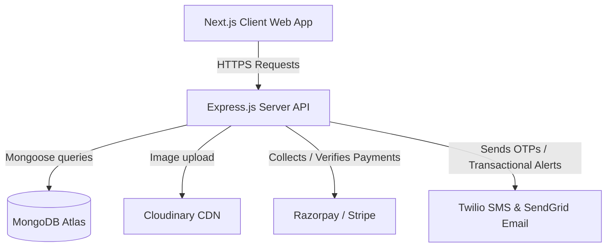

# Software Requirements Specification (SRS)
## Project: Jewellery & Cosmetics E-commerce Website

---

## 1. Introduction

### 1.1 Purpose
This document specifies the software requirements for the premium, mobile-first Jewellery & Cosmetics E-commerce Platform. It defines both functional and non-functional requirements, technical architecture, database schemas, API specifications, and security protocols required to build the platform. This document serves as the single source of truth for developers, QA testers, and stakeholders.

### 1.2 Scope
The system is a high-end e-commerce application targeting the luxury and beauty markets. Inspired by industry leaders like Tanishq, CaratLane, GIVA, Nykaa, and Sephora, the platform will offer:
*   A premium, fully responsive storefront (Next.js, Tailwind CSS, Shadcn UI)
*   A robust customer account portal (OTP & Social Auth)
*   A comprehensive checkout workflow integrated with Razorpay and Stripe
*   A centralized Admin Dashboard for managing products, categories, variants, inventory, orders, discount coupons, banners, and analytics.

### 1.3 Definitions, Acronyms, and Abbreviations
*   **SRS**: Software Requirements Specification
*   **PRD**: Product Requirements Document
*   **OTP**: One-Time Password
*   **JWT**: JSON Web Token
*   **SKU**: Stock Keeping Unit
*   **CMS**: Content Management System
*   **COD**: Cash on Delivery
*   **SEO**: Search Engine Optimization
*   **WCAG**: Web Content Accessibility Guidelines

### 1.4 Tech Stack Reference
*   **Frontend**: Next.js 14+ (App Router), TypeScript, Tailwind CSS, Shadcn UI
*   **State Management**: Redux Toolkit
*   **Backend API**: Node.js, Express.js (TypeScript wrapper optional, standard ES Modules)
*   **Database**: MongoDB (Mongoose ORM)
*   **Payments**: Razorpay (India local) and Stripe (International cards/wallet options)
*   **Storage**: Cloudinary (optimized images) / AWS S3 (backup and raw media assets)
*   **Hosting**: Vercel (Frontend), AWS Elastic Beanstalk or Render (Backend), MongoDB Atlas (Database)

---

## 2. Overall Description

### 2.1 Product Perspective
The platform is composed of three primary blocks:
1.  **Client Web App (Frontend)**: Public-facing, highly visual, SEO-optimized, mobile-first website.
2.  **Server Web API (Backend)**: RESTful API managing business logic, payments, search indexing, notification queues, and admin panel commands.
3.  **Database & Services**: MongoDB Atlas for primary data storage, Cloudinary for image transformations, and third-party gateways (Stripe, Razorpay, Twilio, SendGrid) for communication/billing.



### 2.2 Product Functions
The high-level capabilities of the platform include:
*   **Customer Journey**: Landing Page Navigation $\rightarrow$ Dynamic Category Browsing & Sorting $\rightarrow$ Product Search & Faceted Filter Selection $\rightarrow$ Product Detail Zoom & Variant Customization $\rightarrow$ Add to Wishlist/Cart $\rightarrow$ Coupon Validation $\rightarrow$ Multi-Address Shipping Entry $\rightarrow$ Secure Payment Processing $\rightarrow$ Instant Order Confirmation $\rightarrow$ Order Progress Tracking.
*   **Admin Back-office**: Centralized control center monitoring Sales metrics, Inventory alerts, Product/Category CRUD, Order Fullfillment status (Pending, Processing, Shipped, Delivered, Cancelled), Customer management, Marketing Campaign/Coupon configurations, and Content Management (Homepage Banners & FAQs).

### 2.3 User Classes and Characteristics
1.  **Anonymous Visitors (Guests)**: Can browse the landing pages, category collections, search for items, view detail pages, add products to cart, and proceed to guest checkout.
2.  **Registered Customers**: Can additionally maintain persistent wishlists, manage multiple shipping addresses, view past order history, write reviews, and receive targeted promotions.
3.  **System Administrators**: Have write access to inventory, pricing metadata, CMS configurations, orders fulfillment state, promo engines, and sales analytics.

---

## 3. System Features & Functional Requirements

### 3.1 Authentication & Profile Management
*   **Authentication Options**:
    *   **Email + OTP Passwordless Login**: Users enter their email address. The backend triggers a secure 6-digit OTP code (expires in 10 minutes) sent via transactional email. The user inputs the OTP to generate a valid JWT session token.
    *   **Google OAuth 2.0**: Direct login utilizing Google Identity services.
*   **User Roles**: `customer`, `admin`.
*   **Profile Management**: Customers can update their first name, last name, mobile number, and add/edit/delete multiple addresses (Address Line 1, Address Line 2, City, State, ZIP/Postal Code, Country, Address Tag [Home, Work]).

### 3.2 Product Catalog & Faceted Search
*   **Product Visuals**: High-resolution image galleries with hover-to-zoom capability on desktops and swipe-carousels on mobile devices.
*   **Variants System**:
    *   *Jewellery*: Support for variables such as Metal Type (18k Gold, 22k Gold, Sterling Silver, Platinum), Ring Size (US 5-10 or regional standards), and Diamond/Gem Clarity.
    *   *Cosmetics*: Support for Shades (Hex code visual swatches, shade name), Volume/Size (30ml, 50ml, 100g).
*   **Search**: Full-text searching against index fields (title, category, tags, brand, description).
*   **Filters & Sorting**:
    *   Faceted filtering by Category, Price Range, Brand/Vendor, Average Customer Rating, and Variant Availability.
    *   Sorting options: Best Sellers, New Arrivals, Price: Low to High, Price: High to Low.

### 3.3 Wishlist & Shopping Cart
*   **Wishlist**: Save-for-later collection. Registered users save items to MongoDB. Unauthenticated users' wishlists are persisted temporarily using browser `localStorage` and synced upon subsequent login.
*   **Cart Actions**:
    *   Add to cart with specific variant parameters.
    *   Real-time quantity increments/decrements with live validation against warehouse inventory limits.
    *   Persistent local storage checkout-state for Guest users.

### 3.4 Checkout, Coupons & Payment Processing
*   **Coupons Engine**: Admin defines dynamic promo codes (percentage-based discount, absolute value discount, or free shipping threshold). Code must check active date ranges and minimum purchase conditions.
*   **Payment Gateways**:
    *   **Razorpay**: Integrated via Razorpay Checkout Widget for domestic UPI, Indian Cards, Netbanking, and Wallets.
    *   **Stripe**: Integrated via Stripe Elements/PaymentIntents API for international Credit/Debit cards.
    *   **Cash on Delivery (COD)**: Configurable per-pincode checker to prevent delivery scams in high-risk zones.
*   **Fulfillment States**: `Pending_Payment`, `Processing`, `Shipped`, `Delivered`, `Cancelled`, `Refunded`.

### 3.5 Admin Dashboard
*   **Dashboard Overview**: Key Performance Indicators (KPIs) showing Daily/Monthly GMV (Gross Merchandise Value), Total Orders, Average Order Value (AOV), and Low Stock Alerts.
*   **Product & Category CRUD**: Upload images to Cloudinary, map hierarchical categories, assign attributes (weights, dimensions, ingredients, certification details).
*   **Order Operations**: Update tracking numbers, update order delivery statuses, issue refunds via Stripe/Razorpay integrations.
*   **CMS / Banners Module**: Manage high-resolution desktop and mobile-specific carousel banners, promotional cards, and FAQ tables dynamically.

---

## 4. Database Schema Design (MongoDB & Mongoose)

Below are the entity relationship structures designed to maximize query efficiency while preserving data consistency in MongoDB.

### 4.1 Users Collection
```javascript
const UserSchema = new mongoose.Schema({
  email: { type: String, required: true, unique: true, lowercase: true, trim: true },
  firstName: { type: String, trim: true },
  lastName: { type: String, trim: true },
  mobile: { type: String, trim: true },
  role: { type: String, enum: ['customer', 'admin'], default: 'customer' },
  addresses: [{
    label: { type: String, default: 'Home' }, // Home, Work, etc.
    addressLine1: { type: String, required: true },
    addressLine2: { type: String },
    city: { type: String, required: true },
    state: { type: String, required: true },
    postalCode: { type: String, required: true },
    country: { type: String, required: true },
    isDefault: { type: Boolean, default: false }
  }],
  wishlist: [{ type: mongoose.Schema.Types.ObjectId, ref: 'Product' }],
  createdAt: { type: Date, default: Date.now },
  updatedAt: { type: Date, default: Date.now }
});
```

### 4.2 Products Collection
```javascript
const ProductSchema = new mongoose.Schema({
  title: { type: String, required: true, trim: true },
  slug: { type: String, required: true, unique: true, lowercase: true },
  description: { type: String, required: true },
  longDescription: { type: String },
  category: { type: mongoose.Schema.Types.ObjectId, ref: 'Category', required: true },
  brand: { type: String, required: true, index: true },
  tags: [{ type: String, index: true }],
  type: { type: String, enum: ['jewellery', 'cosmetics'], required: true },
  
  // Array of images hosted on Cloudinary
  images: [{
    url: { type: String, required: true },
    publicId: { type: String, required: true }
  }],
  
  // Configurable dynamic variants
  variants: [{
    sku: { type: String, required: true, unique: true },
    name: { type: String, required: true }, // e.g., "18k Rose Gold / Size 6" or "Matte Red / 30ml"
    price: { type: Number, required: true },
    compareAtPrice: { type: Number }, // Original price for strike-through discount display
    inventory: { type: Number, required: true, default: 0 },
    attributes: {
      color: { type: String }, // CSS Hex code or shade name
      size: { type: String },  // Ring size, cosmetic volume
      material: { type: String } // Gold karat, sterling silver, etc.
    }
  }],
  
  ratings: {
    average: { type: Number, default: 0 },
    count: { type: Number, default: 0 }
  },
  isActive: { type: Boolean, default: true },
  seo: {
    metaTitle: { type: String },
    metaDescription: { type: String },
    keywords: [{ type: String }]
  },
  createdAt: { type: Date, default: Date.now }
});
```

### 4.3 Categories Collection
```javascript
const CategorySchema = new mongoose.Schema({
  name: { type: String, required: true, unique: true, trim: true },
  slug: { type: String, required: true, unique: true, lowercase: true },
  description: { type: String },
  image: {
    url: { type: String },
    publicId: { type: String }
  },
  parentCategory: { type: mongoose.Schema.Types.ObjectId, ref: 'Category', default: null },
  isActive: { type: Boolean, default: true }
});
```

### 4.4 Orders Collection
```javascript
const OrderSchema = new mongoose.Schema({
  orderNumber: { type: String, required: true, unique: true }, // e.g., JC-2026-10002
  customer: { type: mongoose.Schema.Types.ObjectId, ref: 'User', required: false }, // Nullable for Guest checkout
  guestDetails: {
    email: { type: String },
    firstName: { type: String },
    lastName: { type: String },
    mobile: { type: String }
  },
  items: [{
    product: { type: mongoose.Schema.Types.ObjectId, ref: 'Product', required: true },
    variantSku: { type: String, required: true },
    variantName: { type: String, required: true },
    quantity: { type: Number, required: true, min: 1 },
    price: { type: Number, required: true }
  }],
  shippingAddress: {
    addressLine1: { type: String, required: true },
    addressLine2: { type: String },
    city: { type: String, required: true },
    state: { type: String, required: true },
    postalCode: { type: String, required: true },
    country: { type: String, required: true }
  },
  paymentInfo: {
    gateway: { type: String, enum: ['razorpay', 'stripe', 'cod'], required: true },
    paymentId: { type: String }, // Razorpay payment ID or Stripe PaymentIntent ID
    orderId: { type: String },   // Razorpay Order ID (if applicable)
    status: { type: String, enum: ['pending', 'captured', 'failed', 'refunded'], default: 'pending' }
  },
  pricing: {
    subtotal: { type: Number, required: true },
    discount: { type: Number, default: 0 },
    shippingFee: { type: Number, default: 0 },
    tax: { type: Number, default: 0 },
    total: { type: Number, required: true }
  },
  status: {
    type: String,
    enum: ['Pending_Payment', 'Processing', 'Shipped', 'Delivered', 'Cancelled', 'Refunded'],
    default: 'Pending_Payment'
  },
  trackingNumber: { type: String },
  shippingCarrier: { type: String },
  createdAt: { type: Date, default: Date.now },
  updatedAt: { type: Date, default: Date.now }
});
```

---

## 5. API Endpoint Specifications

All endpoints return unified JSON structures. Protected client routes require a valid JWT header (`Authorization: Bearer <TOKEN>`). Admin routes require the active user context role to be `admin`.

### 5.1 Authentication endpoints
*   `POST /api/auth/otp/request`
    *   **Description**: Verifies target email format, generates and sends a 6-digit OTP code to the target inbox.
    *   **Body**: `{ "email": "customer@example.com" }`
    *   **Response**: `{ "success": true, "message": "OTP sent successfully." }`
*   `POST /api/auth/otp/verify`
    *   **Description**: Validates the email/OTP pairing, provisions a session JWT, and returns user data.
    *   **Body**: `{ "email": "customer@example.com", "otp": "123456" }`
    *   **Response**: `{ "success": true, "token": "JWT_TOKEN", "user": { "id": "...", "role": "customer" } }`

### 5.2 Product Discovery endpoints
*   `GET /api/products`
    *   **Parameters**: `search`, `category` (slug), `brand`, `minPrice`, `maxPrice`, `sortBy`, `page`, `limit`.
    *   **Response**: `{ "products": [...], "pagination": { "totalPages": 5, "currentPage": 1 } }`
*   `GET /api/products/:slug`
    *   **Description**: Retrieves single product catalog details.

### 5.3 Checkout & Payment Endpoints
*   `POST /api/orders/create`
    *   **Description**: Locks item stocks, verifies input coupon codes, and initializes transaction session structures inside Razorpay or Stripe.
    *   **Body**: `{ "items": [{"productId": "...", "variantSku": "...", "quantity": 1}], "shippingAddress": {...}, "gateway": "razorpay" }`
    *   **Response**: `{ "success": true, "orderId": "...", "paymentGatewayOrderId": "razorpay_order_id_abc" }`
*   `POST /api/orders/verify`
    *   **Description**: Validates transaction cryptographic hash/signature returned from the SDK Widget to confirm transaction completion.
    *   **Body**: `{ "orderId": "...", "paymentId": "...", "signature": "..." }`

---

## 6. Non-Functional Requirements (NFR)

### 6.1 Performance
*   **Page Load Time**: The homepage, collections page, and key landing interfaces must achieve a Google Lighthouse performance score of $\ge 90$ and First Contentful Paint (FCP) under 1.5 seconds.
*   **API Response Uptime**: Server endpoints (excluding external webhooks) must respond in under 200ms for 95% of requests.
*   **Scalability**: Leverage Next.js Static Site Generation (SSG) for static marketing content and Incremental Static Regeneration (ISR) for fast product listing page revalidation.

### 6.2 Security
*   **Data Encryption**: HTTPS enforced across all entry channels. Session data/JWTs encrypted using HS256 with robust secret rolling cycles.
*   **Role-Based Access Control (RBAC)**: All routes prefixed with `/api/admin` must pass verification checks ensuring the payload role field holds the `'admin'` configuration.
*   **PCI Compliance**: Direct credit card handling is completely bypassed by offloading credit details capturing securely inside Stripe Elements iframe environments.

### 6.3 Accessibility & SEO
*   **WCAG 2.1 Compliance**: Contrast checks, alt-tags on product photos, screen reader keyboard nav mappings for main menus, and clear error notifications.
*   **SEO Parameters**: Automatic structured JSON-LD schemas generated dynamically on product pages to populate Rich Product Snippets in Google Search. Next.js metadata dynamically updated for all dynamic routing directories.

---

## 7. MVP Scope Mapping

| Module | Features Included in MVP | Deferred / Next Phase |
| :--- | :--- | :--- |
| **Auth** | OTP Email Login, Google Auth | Multi-factor Auth (MFA), Phone OTP via SMS |
| **Catalog** | Category browse, standard filters (price/brand), variants | 3D Try-On for Jewellery, Shade Finder AR Camera |
| **Checkout** | Razorpay, Stripe, standard coupon codes, default shipping | Subscriptions, Buy Now Pay Later (BNPL) integrations |
| **Admin** | Catalog CRUD, Order tracking status toggling, Reports | Auto-invoicing, Warehouse Management System integration |
| **Marketing**| SEO optimization, dynamic coupon engine | Automated abandoned cart SMS alerts via Twilio |
